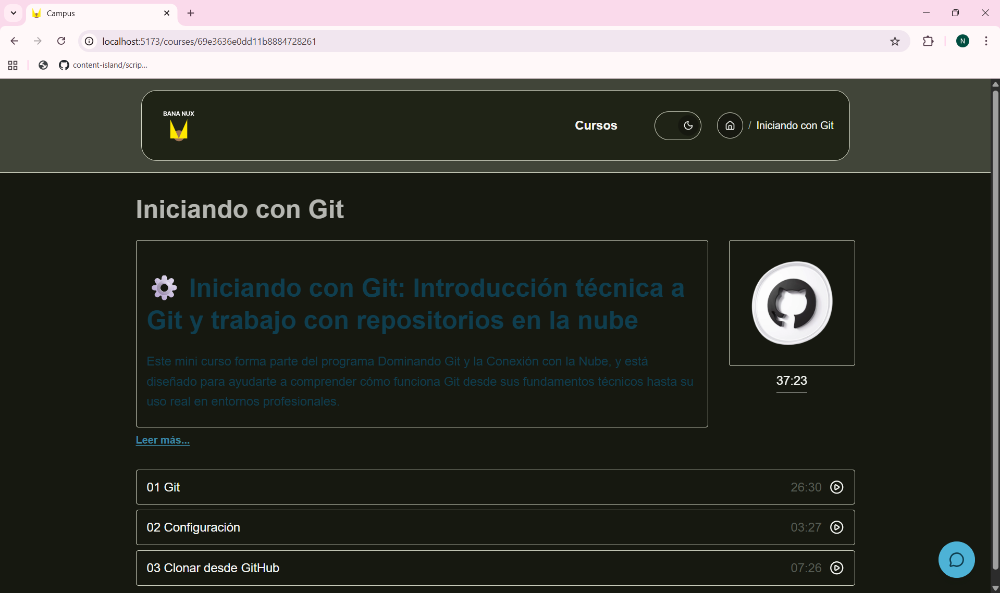
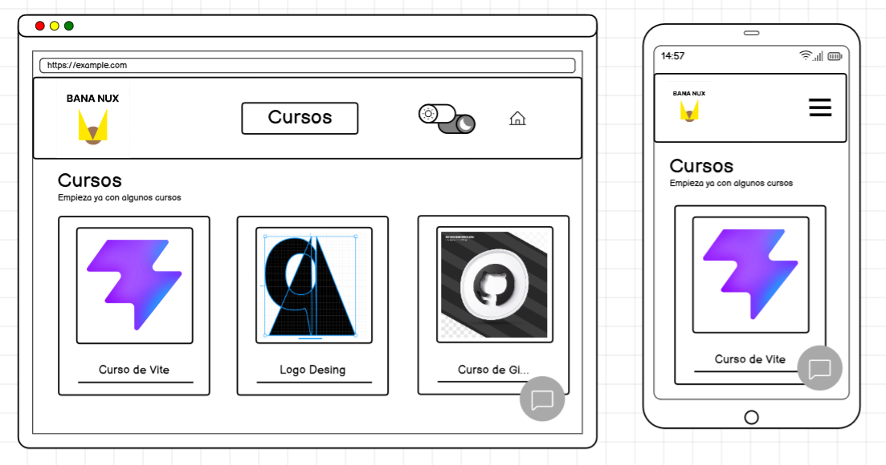
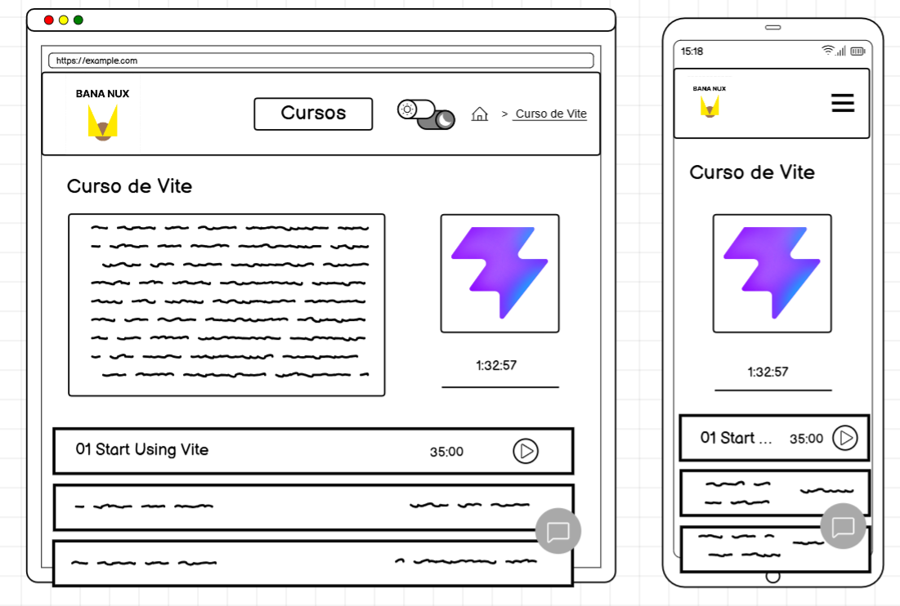
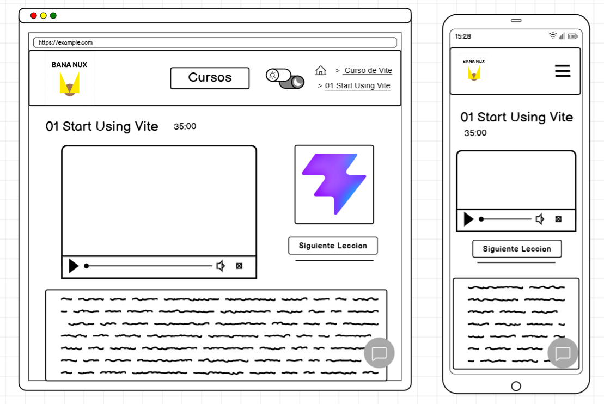
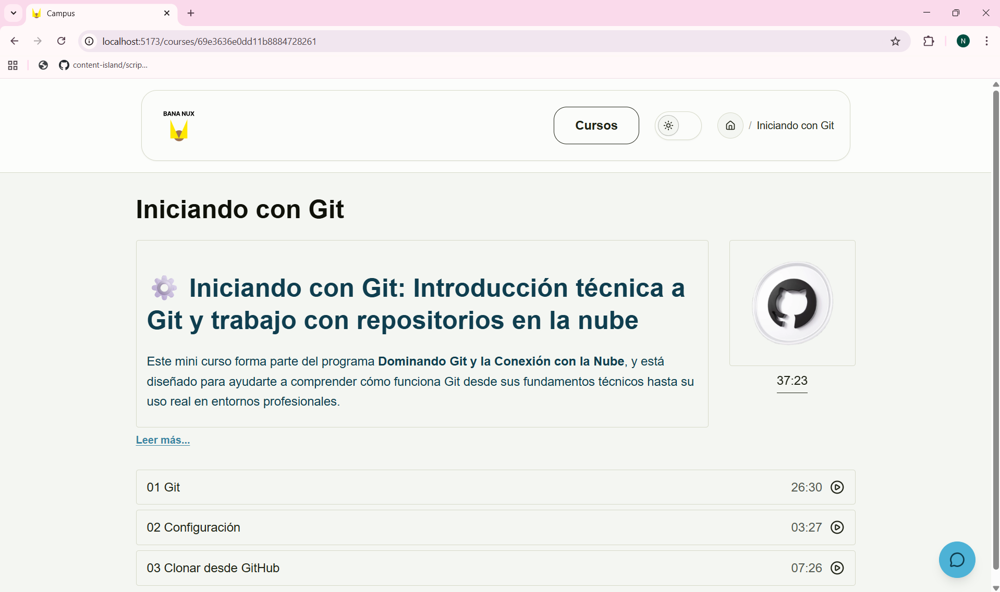
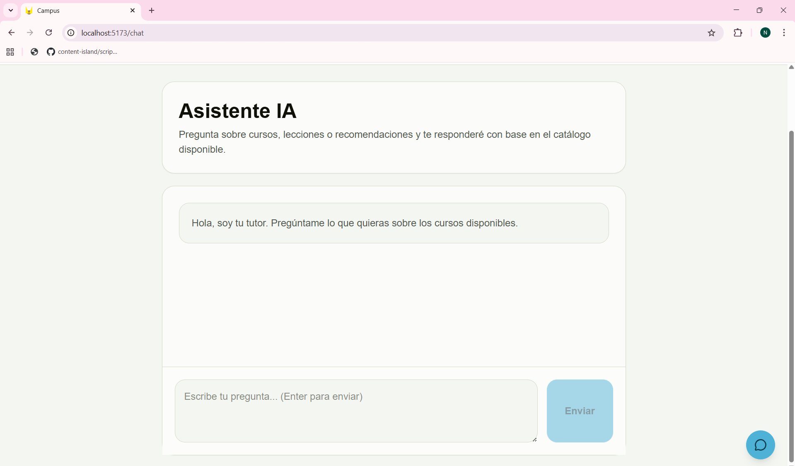
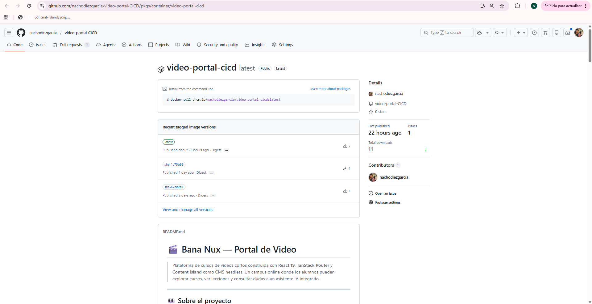
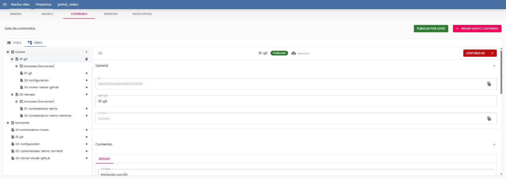
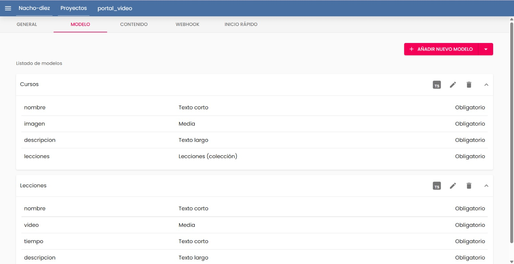

# 🎬 Bana Nux — Portal de Video

> Plataforma de cursos de vídeos cortos construida con **React 19**, **TanStack Router** y **Content Island** como CMS headless. Un campus online donde los alumnos pueden explorar cursos, ver lecciones y consultar dudas a un asistente IA integrado.

---

## 👀 Sobre el proyecto

Este portal permite a los usuarios navegar por un catálogo de cursos, acceder al detalle de cada uno con su lista de lecciones y reproducir vídeos directamente desde la plataforma. Incluye un **reproductor de vídeo propio** (vanilla + binding React), un **chat IA** con asistente contextual y soporte de **tema oscuro/claro**.

El contenido (cursos, lecciones, vídeos e imágenes) es gestionado de forma desacoplada a través de **Content Island**, lo que permite añadir o modificar cursos sin tocar el código.

[Configuración CI/CD proteccion de ramas y diagrama de flujo](./configuracion-Y-fiagrama-de-flujo.md)

---

## 🎨 Identidad visual — Logo

El logotipo de **Bana Nux** lo diseñé a mano yo desde cero con **Figma**. Se hice tres variantes SVG para adaptarse a cada contexto de la aplicación:

| Variante | Archivo | Uso |
| :--- | :--- | :--- |
| Light mode | `bananux_logo.svg` | Fondo claro — texto en negro |
| Dark mode | `bananux_logo_dark.svg` | Fondo oscuro — texto en blanco |
| Favicon | `bannaNux_favicon.svg` | Icono de pestaña del navegador |

**Logo — Light mode**


**Logo — Dark mode**


**Favicon**


---

## 🌗 Tema claro y oscuro

La aplicación incluye soporte completo de **light / dark mode**, alternando mediante un botón en la cabecera. El logo cambia automáticamente según el tema activo para mantener el contraste y la legibilidad.

**Vista en modo oscuro — Cursos**



---

## 🖼️ Capturas del diseño

### 📐 Mockups (Quickmock)

**Listado de cursos — Desktop y Mobile**



**Detalle de un curso — Desktop y Mobile**



**Reproductor de lección — Desktop y Mobile**



### 🚀 Mostrando un poco de la App

**Vista de detalle de curso**



**Vista del asistente IA**



---

## 🛠️ Tecnologías

| Tecnología | Uso |
| :--- | :--- |
| [React](https://react.dev) v19 | Framework UI principal |
| [Vite](https://vitejs.dev) v8 | Bundler y servidor de desarrollo |
| [TanStack Router](https://tanstack.com/router) | Enrutado tipado con file-based routing |
| [TanStack Query](https://tanstack.com/query) | Caché y sincronización de datos asíncronos |
| [Tailwind CSS](https://tailwindcss.com) v4 | Estilos utilitarios |
| [Content Island](https://content-island.io) | CMS headless — fuente de verdad del contenido |
| [marked](https://marked.js.org) | Parseo de Markdown en descripciones |
| TypeScript | Tipado estático en modelos, mappers y APIs |

---

## 🏗️ Arquitectura

El proyecto sigue un patrón de **pods** donde cada sección de la aplicación es autónoma y autocontenida:

```
portal-video-practica/
└── src/
    ├── main.tsx                  # Punto de entrada — Router + QueryClient
    ├── routes/                   # File-based routing (TanStack Router)
    │   ├── __root.tsx            # Layout raíz: Header + ChatFab + Outlet
    │   ├── index.tsx             # / → Listado de cursos
    │   ├── chat.tsx              # /chat → Asistente IA
    │   └── courses/
    │       ├── $courseId.tsx     # /courses/:id → Detalle del curso
    │       └── lesson/
    │           └── $courseId.$lessonIndex.tsx  # /lesson/:id/:idx → Lección
    ├── pods/                     # Lógica de negocio por sección
    │   ├── courses/              # Catálogo de cursos
    │   ├── course-detail/        # Detalle + lista de lecciones
    │   ├── lesson-detail/        # Reproductor + chat por lección
    │   ├── chat/                 # Asistente IA global
    │   └── site-config/         # Configuración del sitio
    ├── components/               # Componentes compartidos
    │   ├── header/               # Navegación fija con breadcrumb y tema
    │   ├── video-player/         # Reproductor propio (vanilla + React binding)
    │   ├── chat-fab/             # Botón flotante de chat
    │   └── markdown/             # Renderizado de Markdown
    └── common/
        ├── api/client.ts         # Cliente de Content Island
        └── models/               # Interfaces TypeScript (Cursos, Lecciones, Media)
```

Cada pod contiene su propio:
- **`*.api.ts`** — llamada a la API de Content Island
- **`*.component.tsx`** — componente de presentación React

---

## 🐳 Imagen Docker

La aplicación se empaqueta automáticamente como una imagen Docker y se publica en **GitHub Container Registry (GHCR)** tras cada merge a `main` a través del pipeline de CD.



```sh
docker pull ghcr.io/nachodiezgarcia/video-portal-cicd:latest
```

---

## 📦 Content Island — Modelo de datos

Content Island actúa como el CMS headless del proyecto. Los datos se organizan en dos modelos:

### Vista de contenidos (árbol)



### Modelos definidos



| Modelo | Campo | Tipo | Obligatorio |
| :--- | :--- | :--- | :---: |
| **Cursos** | `nombre` | Texto corto | ✅ |
| | `imagen` | Media | ✅ |
| | `descripcion` | Texto largo | ✅ |
| | `lecciones` | Lecciones (colección) | ✅ |
| **Lecciones** | `nombre` | Texto corto | ✅ |
| | `video` | Media | ✅ |
| | `tiempo` | Texto corto | ✅ |
| | `descripcion` | Texto largo | ✅ |

---

## 🗄️ Modelado MongoDB

El modelo de base de datos refleja la misma estructura de dos colecciones con una relación **1:N** entre cursos y lecciones:

### Colección `Cursos`

| Campo | Tipo | Descripción |
| :--- | :--- | :--- |
| `_id` | ObjectId (PK) | Identificador único del curso |
| `nombre` | String | Nombre del curso |
| `imagen` | String | URL de la imagen de portada |
| `descripcion` | String | Descripción larga del curso |
| `lecciones` | Array\<Object\> | Subdocumentos embebidos con resumen de lección |
| `lecciones[].id_leccion` | ObjectId | Referencia a la colección Lecciones |
| `lecciones[].nombre` | String | Nombre de la lección |
| `lecciones[].tiempo` | String | Duración de la lección |

### Colección `Lecciones`

| Campo | Tipo | Descripción |
| :--- | :--- | :--- |
| `_id` | ObjectId (PK) | Identificador único de la lección |
| `id_curso` | String | Referencia al curso padre |
| `nombre` | String | Título de la lección |
| `video` | String | URL del vídeo |
| `descripcion` | String | Descripción y contenido de la lección |
| `tiempo` | String | Duración del vídeo |

```
Cursos (1) ──────────────────────── (N) Lecciones
  _id  ◄─────── lecciones[].id_leccion ──── id_curso
```

---

## 🧞 Comandos

Desde la carpeta `portal-video-practica/`:

| Comando | Acción |
| :--- | :--- |
| `npm install` | Instala las dependencias |
| `npm run dev` | Servidor de desarrollo en `localhost:5173` |
| `npm run build` | Build de producción en `./dist/` |
| `npm run preview` | Preview del build antes de desplegar |
| `npm run lint` | Análisis estático con ESLint |

---

## 🔑 Variables de entorno

Crea un archivo `.env` en la raíz de `portal-video-practica/` con tu token de Content Island y su token de acceso a OpenRouter API, para que el chat IA funcione correctamente:

```sh
VITE_CONTENT_ISLAND_TOKEN=tu_token_aqui
```

```sh
VITE_OPENROUTER_API_KEY=tu_token_aqui
```

---

*Hecho con 🎬 para el módulo de CI/CD con Orquestadores — DAW2*
