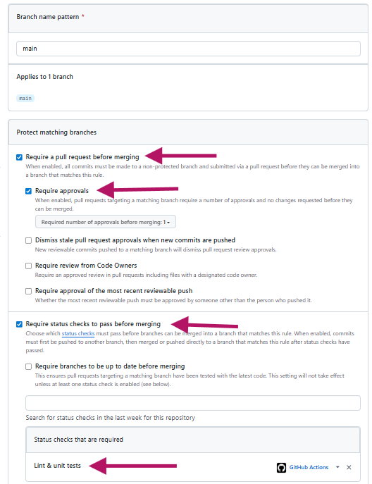

# Configuración del Proyecto: CI/CD, Docker y Variables

## Variables de Entorno (GitHub)
Tengo en GitHub 5 variables de entorno:

* **Content Island Token:** Para coger los datos del proyecto de Content Island.
* **OPENROUTER:** Para la IA del chat.
* **RENDER_DEPLOY_HOOK_URL:** URL de Render que avisa a Render de los cambios en el repo.
* **Image Name:** Nombre de la imagen de Docker.
* **Image TAG:** Versión de la imagen de Docker.

---

## CI (Integración Continua)
* El **CI** se activa cuando se mezclan *pull requests* a `main`.
* Primero hacemos los test con **lint**.
* Se ejecuta en un **ubuntu**.
* El directorio de trabajo es la carpeta `app` donde tenemos todo el código fuente.
* Ponemos la **versión 20 de Node**.
* Instalamos dependencias con `npm ci`.
* Vemos el revisado de código (lint).
* Hacemos los **test unitarios** que son de los videos.

---

## CD (Despliegue Continuo)
* El **CD** empieza cuando hay cambios en `main`.
* Hacemos este en un **ubuntu**.
* Los permisos deben ser de **lectura y escritura**.
* Instalamos con `npm ci` para que instale las dependencias directamente del `package-lock.json` y, si alguna dependencia no está instalada, lo hace internamente.
* **Inyectamos las env** para poder hacer el build.
* Construimos la imagen de Docker haciendo un `build` y un `push`.
* **Avisamos a Render** para que arranque el nuevo contenedor; si no, aunque se suba el push, no se accionaría y no habría un nuevo deploy.

---

## DOCKERFILE
* Usamos un **alpine**.
* Ponemos nuestra configuración en la del alpine.
* Ponemos nuestra carpeta `dist` dentro de una carpeta de alpine para que pueda leer estos archivos.
* Escucha por el **puerto 8080**.
* **CMD** enciende el servidor web y contiene Nginx ejecutándose en primer plano.

## Protección de Ramas
* Las restincciones para que no deje mezclar si no pasa el CI, el CD o el Linter y los unit test

## Diagrama de Flujo

       ┌─────────────────────────────────────────────────────────┐
       │                 FLUJO DE TRABAJO CI / CD                │
       └────────────────────────────┬────────────────────────────┘
                                    │
                         git push (rama feature)
                                    ▼
       ┌─────────────────────────────────────────────────────────┐
       │                  PULL REQUEST -> MAIN                   │
       └────────────────────────────┬────────────────────────────┘
                                    │ dispara ci.yml
                                    ▼
       ┌─────────────────────────────────────────────────────────┐
       │             CI (Ubuntu / Node 20 / app dir)             │
       │                                                         │
       │  [ npm ci ] ──▶ [ Lint ] ──▶ [ Test Unitarios Vitest ] │
       └────────────────────────────┬────────────────────────────┘
                                    │
                  ┌─────────────────┴─────────────────┐
                  ▼                                   ▼
       ┌────────────────────┐               ┌────────────────────┐
       │   FALLA EN TESTS   │               │   TESTS PASADOS    │
       │         ❌        │               │         ✅         │
       └──────────┬─────────┘               └──────────┬─────────┘
                  │                                    │
                  ▼                                    ▼
       ┌────────────────────┐               ┌────────────────────┐
       │  MERGE BLOQUEADO   │               │ BRANCH PROTECTION  │
       │ (GitHub Settings)  │               │  Permite el Merge  │
       └────────────────────┘               └──────────┬─────────┘
                                                       │
                                            Merge a main (cd.yml)
                                                       ▼
       ┌─────────────────────────────────────────────────────────┐
       │                  CD (Ubuntu / Node 20)                  │
       │                                                         │
       │ [ Build Vite ] ──▶ [ Docker Build ] ──▶ [ Push GHCR ]  │
       └────────────────────────────┬────────────────────────────┘
                                    │
                                    ▼
       ┌─────────────────────────────────────────────────────────┐
       │            NOTIFICACIÓN Y DESPLIEGUE FINAL              │
       │                                                         │
       │  [ Render Deploy Hook ] ──▶ [ Nuevo Contenedor 🚀 ]    │
       └─────────────────────────────────────────────────────────┘
       
  El flujo es: PR => CI (lint + tests) => si pasa, merge permitido => CD (build + Docker + Render).